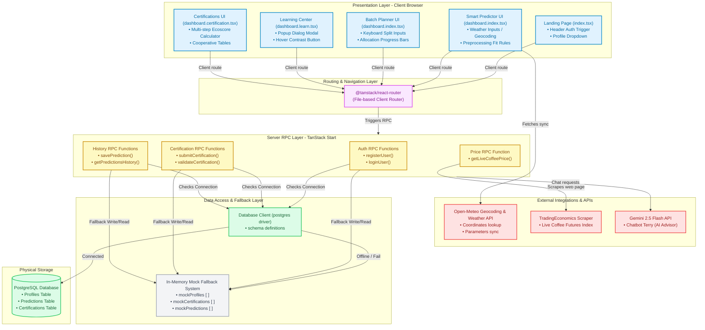

# TerraBrew System Architecture & Layer Diagram

This document describes the architectural layout, data flow, and layers of the TerraBrew application, including the new **Batch Planner & Scraper** feature. 

---

## 1. Layers & Component Architecture

Below is the layered representation of the system. You can copy the code block below and insert it directly into Draw.io under **Arrange -> Insert -> Advanced -> Mermaid** to instantly generate an editable vector diagram.

---

## 2. Layer Definitions & System Responsibilities

### 1. Presentation Layer (Frontend React Components)
Responsible for capturing user inputs, triggering visual transitions (such as loader spins and dynamic split allocation progress bars), and rendering interactive charts (Pie Charts, Bar Charts, and Polar Radar Charts).
*   **Weather Predictor View**: Manages local variables for rainfall, humidity, and temperature.
*   **Batch Planner View**: Validates that custom splits equal exactly 100% and contains the "Process Batch Allocation" click trigger.
*   **Auth Menu Dropdown**: Displays initials in the top nav and updates dynamically based on current user authentication states.

### 2. Routing & Navigation Layer
Powered by `@tanstack/react-router`, providing type-safe file-based client-side routing. Navigates between landing page pathways (`/`) and internal validation spaces (`/dashboard/*`).

### 3. Server Actions Layer (TanStack Start RPC)
Handles asynchronous RPC (Remote Procedure Call) methods using `createServerFn`. Executes server-side code hidden from client browsers to protect private keys and bypass security restrictions (like CORS headers).
*   **Scraper**: The `getLiveCoffeePrice()` server action fetches the external HTML from TradingEconomics and parses values directly in the server process.

### 4. External Integrations Layer
Connects to 3rd-party services to enrich TerraBrew's operational capabilities:
*   **Open-Meteo API**: Synced client-side to coordinate temperature and rainfall patterns.
*   **Gemini 2.5 API**: Prompts Terry the Chatbot using AI system instructions for speciality coffee guidelines.
*   **TradingEconomics API**: Leverages HTML source pattern-matching to parse global Arabica indices.

### 5. Data Access & Fallback Layer
Coordinates credentials validation and histories saving. Incorporates a database availability listener:
*   **Active Mode**: Communicates with the PostgreSQL server using raw SQL queries to insert profiles, predictions, and auditor validations.
*   **Mock Fallback Mode**: Activates if Postgres is unreachable. Intercepts database calls and updates local array storages, ensuring the website continues to function smoothly.

---

## 3. Tech Stack Architecture Summary (Tailored)

The system follows a three-tier architecture. The **presentation layer** renders ClimateSense inputs, BrewMatch recommendations, EcoScore dashboards, RiskGuard alerts, and TerraAI (Terry Chatbot) interface. The **application layer** handles routing between the client UI and the server RPC actions using TanStack Start's server functions (`createServerFn`), computing sustainability indices and agronomic risk thresholds. The **prediction and computation layer** accepts environmental inputs (temperature, humidity, rainfall, and water availability) and returns ranked processing method compatibilities across washed, honey, natural, semi-washed, and wine (controlled fermentation) methods. Heuristic fit scores drive RiskGuard risk profile sync alerts. **TerraAI** (Terry Chatbot) is powered by the Gemini 2.5 Flash API, configured via detailed post-harvest coffee domain parameters, enabling context-aware, explainable guidance for farmers and auditors.

---

## 4. Data Sourcing & Deployment Infrastructure (Tailored)

Primary data comes from user-submitted environmental parameters, supplemented by real-time climate telemetry auto-filled via the Open-Meteo Geocoding and Weather API. Future integration with BMKG's open weather API will enable localized Indonesian weather alerts. The unified full-stack application is built on TanStack Start (Vite & Nitro), storing persistent data in a PostgreSQL database, supplemented by an active server-side in-memory mock database fallback. This forms a highly resilient, low-latency infrastructure accessible across Indonesian farming regions.
